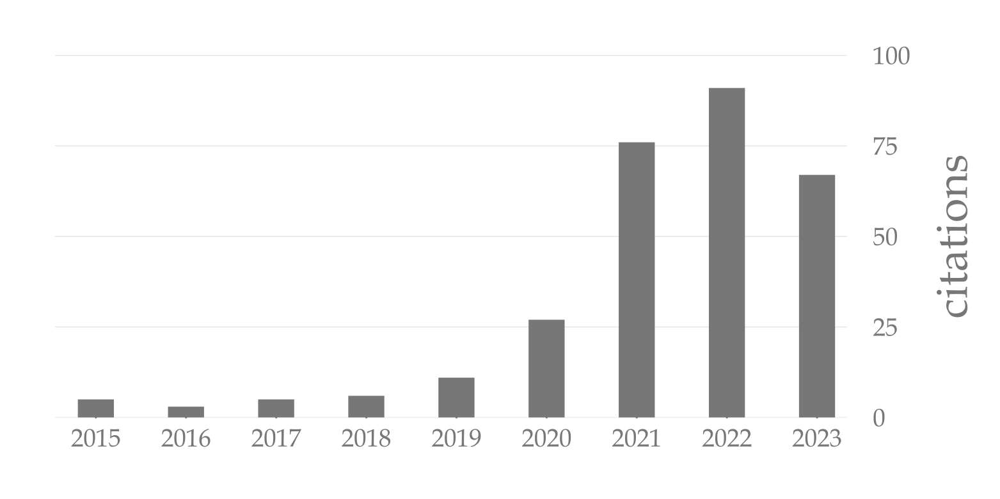

# GoogleScholar.jl

A light-weight Julia package to read and plot [Google Scholar](https://scholar.google.com/citations?hl=en&view_op=search_authors&mauthors=Robert+J.+Moss&btnG=) citation information.

## Installation

```julia
] add https://github.com/mossr/GoogleScholar.jl
```

## Usage

```julia
using GoogleScholar

scholar = Scholar(user="OdCpu9sAAAAJ") # Robert J. Moss
get_citation_history!(scholar)

plot_citations(scholar)
bettersavefig("google-scholar-citations.png"; dpi=300) # higher resolution
```

<p align="center">
  
</p>
